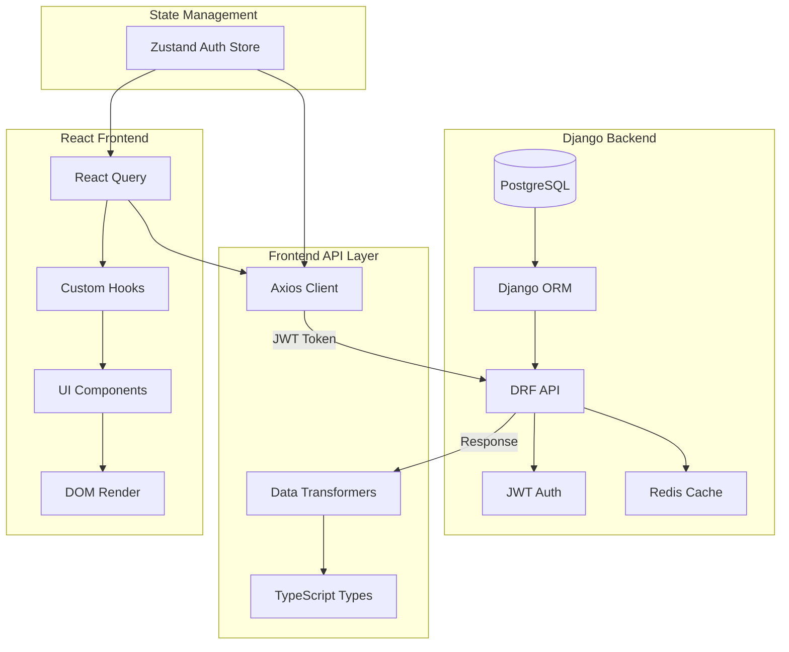
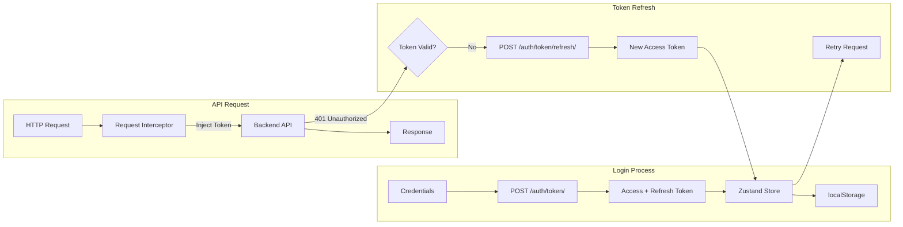
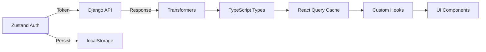

# Project Architecture Document (PAD) - iTrust Academy

> **The Definitive Technical Handbook & Source of Truth**
> **Project**: iTrust Academy - Enterprise IT Training Platform
> **Version**: 2.0.0
> **Last Updated**: March 29, 2026
> **Status**: Full-Stack Integration Complete

---

## 1. Introduction & Purpose
This document serves as the primary technical blueprint for iTrust Academy. It provides a comprehensive map of the application's architecture, data structures, and operational flows. It is designed to initialize new developers or AI coding agents, enabling them to understand the system's DNA and handle PRs with minimal guidance.

**Architecture Type**: Full-Stack (React Frontend + Django Backend)

---

## 2. Tech Stack Deep Dive

### 2.1 Frontend Stack
| Layer | Technology | Key Role |
| :--- | :--- | :--- |
| **Framework** | **React 19** | Core UI library utilizing modern hooks and concurrent rendering. |
| **Language** | **TypeScript 5.9** | Strict typing for build-time safety and self-documenting code. |
| **Build Tool** | **Vite 8** | Next-generation frontend tooling for HMR and optimized builds. |
| **Styling** | **Tailwind CSS v4** | CSS-first configuration, zero-JS runtime, high-performance styling. |
| **Animation** | **Framer Motion 12** | Scroll-linked animations and entrance transitions. |
| **Components** | **Radix UI** | Headless primitives ensuring WCAG AAA accessibility. |
| **State** | **Zustand 5** | Lightweight, fast external store for global state management. |
| **Validation** | **Zod 4** | Schema-first validation for data integrity and forms. |
| **Server State** | **TanStack Query 5** | Server state management with caching and synchronization. |
| **HTTP Client** | **Axios 1.14** | HTTP client with JWT interceptor support. |

### 2.2 Backend Stack
| Layer | Technology | Key Role |
| :--- | :--- | :--- |
| **Framework** | **Django 6.0.3** | High-level Python web framework for rapid development. |
| **API** | **Django REST Framework 3.16** | Toolkit for building Web APIs with serialization. |
| **Database** | **PostgreSQL 16** | Relational database for structured data storage. |
| **Cache** | **Redis 7** | In-memory data store for caching and sessions. |
| **Auth** | **SimpleJWT** | JSON Web Token authentication for stateless auth. |
| **Payments** | **Stripe 14.4** | Payment processing integration. |
| **Object Storage** | **MinIO** | S3-compatible object storage for media files. |
| **Task Queue** | **Celery 5.6** | Asynchronous task processing. |

### 2.3 DevOps & Infrastructure
| Layer | Technology | Key Role |
| :--- | :--- | :--- |
| **Containers** | **Docker** | Containerization for consistent environments. |
| **Orchestration** | **Docker Compose** | Multi-container application management. |
| **Web Server** | **Gunicorn** | Python WSGI HTTP Server for production. |
| **Static Files** | **WhiteNoise** | Static file serving without CDN dependency. |
| **API Docs** | **drf-spectacular** | OpenAPI/Swagger documentation generation. |

---

## 3. File Hierarchy & Manifest

### 3.1 Full-Stack Directory Structure
```text
itrust-academy/
├── 📁 src/                          # React Frontend
│   ├── app/                         # Application Core & Configuration
│   │   ├── app.tsx                  # Main App component (Section orchestrator)
│   │   └── globals.css              # Tailwind v4 theme, variables, and global resets
│   ├── components/                  # Component Library
│   │   ├── cards/                   # Composite card components (e.g., CourseCard)
│   │   ├── forms/                   # Form-specific logic and UI (React Hook Form)
│   │   ├── icons/                   # Custom SVG brand icons (Lucide-compatible)
│   │   ├── layout/                  # Global Layout: Header, Light Footer, Section Wrappers
│   │   ├── sections/                # Feature-specific landing page sections
│   │   └── ui/                      # Atomic UI primitives (Button, Badge, Input, etc.)
│   ├── services/                    # API Integration Layer
│   │   └── api/
│   │       ├── client.ts            # Axios instance with JWT interceptors
│   │       ├── types.ts             # API response types (Backend & Frontend)
│   │       ├── transformers.ts      # snake_case → camelCase transformers
│   │       ├── courses.ts           # Course API functions
│   │       ├── categories.ts        # Category API functions
│   │       └── auth.ts              # Authentication API functions
│   ├── store/                       # Global State Management
│   │   └── useAuthStore.ts          # Zustand JWT token persistence
│   ├── hooks/                       # Custom React Hooks
│   │   ├── useCourses.ts            # Course query hooks (React Query)
│   │   ├── useCategories.ts         # Category query hooks (React Query)
│   │   ├── useAuth.ts               # Auth mutation hooks
│   │   └── useReducedMotion.ts      # Accessibility hook
│   ├── providers/                   # Context Providers
│   │   └── QueryProvider.tsx        # TanStack Query configuration
│   ├── data/                        # Static Data (fallback/legacy)
│   │   └── courses.ts               # Course data & types
│   ├── lib/                         # Utilities & Constants
│   │   ├── constants.ts             # App constants & API_URL
│   │   └── utils.ts                 # Utility functions
│   └── types/                       # Type Definitions
│       └── vite-env.d.ts            # Vite environment declarations
│
├── 📁 backend/                      # Django Backend
│   ├── academy/                     # Django Project Configuration
│   │   ├── settings/                # Environment-specific settings
│   │   │   ├── base.py              # Base settings
│   │   │   ├── development.py       # Development settings
│   │   │   ├── production.py        # Production settings
│   │   │   └── test.py              # Test settings
│   │   ├── urls.py                  # Root URL configuration
│   │   ├── wsgi.py                  # WSGI entry point
│   │   └── asgi.py                  # ASGI entry point
│   ├── api/                         # REST API Application
│   │   ├── views/                   # ViewSets and API Views
│   │   │   ├── all_views.py         # Main API views
│   │   │   └── payments.py          # Payment processing views
│   │   ├── serializers.py           # DRF serializers
│   │   ├── responses.py             # Standardized response format
│   │   ├── middleware.py            # Custom middleware
│   │   ├── throttles.py             # Rate limiting
│   │   ├── exceptions.py            # Custom exception handlers
│   │   └── tests/                   # API tests
│   ├── courses/                     # Course Management App
│   │   ├── models.py                # Course, Cohort, Enrollment models
│   │   ├── admin.py                 # Django admin configuration
│   │   ├── signals.py               # Cache invalidation signals
│   │   └── migrations/              # Database migrations
│   ├── users/                       # User Management App
│   │   ├── models.py                # Custom User model
│   │   └── admin.py                 # User admin configuration
│   ├── requirements/                # Python dependencies
│   │   └── base.txt                 # Production requirements
│   └── manage.py                    # Django management script
│
├── 📁 screenshots/                  # UI verification screenshots
├── docker-compose.yml               # PostgreSQL, Redis, MinIO containers
├── package.json                     # Frontend dependencies
├── vite.config.ts                   # Vite configuration
└── tsconfig.json                    # TypeScript configuration
```

### 3.2 Key File Descriptions
| File | Role | Responsibility |
| :--- | :--- | :--- |
| `src/main.tsx` | Entry Point | Mounts React with QueryProvider wrapper. |
| `src/app/app.tsx` | Root Component | Orchestrates the vertical stacking of all landing page sections. |
| `src/app/globals.css` | Theme Engine | Defines OKLCH colors, brand shadows, and Tailwind v4 @theme. |
| `src/services/api/client.ts` | API Client | Axios instance with JWT interceptors and response unwrapping. |
| `src/services/api/types.ts` | Type Definitions | Backend/Frontend type mappings for API communication. |
| `src/services/api/transformers.ts` | Data Transformers | Converts snake_case API responses to camelCase frontend types. |
| `src/store/useAuthStore.ts` | Auth State | Zustand store for JWT token persistence. |
| `src/hooks/useCourses.ts` | Data Hooks | React Query hooks for course data fetching. |
| `backend/courses/models.py` | Data Models | Course, Category, Cohort, Enrollment database models. |
| `backend/api/serializers.py` | Serializers | DRF serializers for API response formatting. |
| `backend/api/responses.py` | Response Handler | Standardized API response envelope. |

---

## 4. Application Flowcharts

### 4.1 User Interaction Flow
The user navigates via a sticky header to interact with various value-driven sections.


### 4.2 Full-Stack Data Flow
Data flows from the Django backend through API services to React components.



### 4.3 Authentication Flow
JWT authentication with automatic token refresh.



---

## 5. Data Architecture (Database Schema)

### 5.1 PostgreSQL Database Schema

#### Course Model (Django)
| Property | Type | Constraints | Description |
| :--- | :--- | :--- | :--- |
| `id` | `UUID` | Primary Key | Unique identifier. |
| `slug` | `SlugField` | Unique | URL-friendly identifier. |
| `title` | `CharField(200)` | Required | Main course headline. |
| `subtitle` | `CharField(300)` | Required | Short description. |
| `description` | `TextField` | Required | Full course description. |
| `thumbnail` | `ImageField` | Nullable | Course thumbnail image. |
| `categories` | `ManyToMany` | FK to Category | Course categories. |
| `level` | `CharField` | Choices | beginner/intermediate/advanced. |
| `modules_count` | `PositiveIntegerField` | Default 0 | Number of modules. |
| `duration_weeks` | `PositiveIntegerField` | Required | Course duration in weeks. |
| `duration_hours` | `PositiveIntegerField` | Required | Course duration in hours. |
| `price` | `DecimalField` | Max 10 digits | Current price. |
| `original_price` | `DecimalField` | Nullable | Original price (for discounts). |
| `currency` | `CharField(3)` | Default USD | Currency code. |
| `rating` | `DecimalField(2,1)` | Default 0.0 | Average rating. |
| `review_count` | `PositiveIntegerField` | Default 0 | Number of reviews. |
| `enrolled_count` | `PositiveIntegerField` | Default 0 | Total enrollments. |
| `is_featured` | `BooleanField` | Default False | Featured course flag. |
| `status` | `CharField` | Choices | draft/published/archived. |
| `created_at` | `DateTimeField` | Auto | Creation timestamp. |
| `updated_at` | `DateTimeField` | Auto | Last update timestamp. |
| `deleted_at` | `DateTimeField` | Nullable | Soft delete timestamp. |

#### Category Model
| Property | Type | Constraints | Description |
| :--- | :--- | :--- | :--- |
| `id` | `IntegerField` | Primary Key | Auto-increment ID. |
| `name` | `CharField(100)` | Required | Category name. |
| `slug` | `SlugField` | Unique | URL identifier. |
| `description` | `TextField` | Blank allowed | Category description. |
| `color` | `CharField(7)` | Default #4f46e5 | Brand color (HEX). |
| `icon` | `CharField(50)` | Blank allowed | Icon identifier. |
| `order` | `PositiveIntegerField` | Default 0 | Sort order. |

#### Cohort Model
| Property | Type | Constraints | Description |
| :--- | :--- | :--- | :--- |
| `id` | `UUID` | Primary Key | Unique identifier. |
| `course` | `ForeignKey` | Required | Related course. |
| `start_date` | `DateField` | Required | Cohort start date. |
| `end_date` | `DateField` | Required | Cohort end date. |
| `timezone` | `CharField(50)` | Default EST | Timezone. |
| `format` | `CharField` | Choices | online/in_person/hybrid. |
| `location` | `CharField(200)` | Blank allowed | Physical location. |
| `instructor` | `ForeignKey` | Nullable | Instructor user. |
| `spots_total` | `PositiveIntegerField` | Default 30 | Maximum capacity. |
| `spots_reserved` | `PositiveIntegerField` | Default 0 | Currently enrolled. |
| `status` | `CharField` | Choices | upcoming/enrolling/in_progress/completed/cancelled. |

#### Enrollment Model
| Property | Type | Constraints | Description |
| :--- | :--- | :--- | :--- |
| `id` | `UUID` | Primary Key | Unique identifier. |
| `user` | `ForeignKey` | Required | Enrolled user. |
| `course` | `ForeignKey` | Required | Enrolled course. |
| `cohort` | `ForeignKey` | Required | Specific cohort. |
| `amount_paid` | `DecimalField` | Max 10 digits | Payment amount. |
| `currency` | `CharField(3)` | Default USD | Currency code. |
| `stripe_payment_intent_id` | `CharField(200)` | Blank | Stripe payment reference. |
| `status` | `CharField` | Choices | pending/confirmed/cancelled/completed/refunded. |
| `created_at` | `DateTimeField` | Auto | Enrollment timestamp. |
| `confirmed_at` | `DateTimeField` | Nullable | Confirmation timestamp. |

---

## 6. API Endpoints Reference

### 6.1 Authentication Endpoints
| Method | Endpoint | Description | Auth Required |
| :--- | :--- | :--- | :--- |
| `POST` | `/api/v1/auth/token/` | Get JWT access/refresh tokens | No |
| `POST` | `/api/v1/auth/token/refresh/` | Refresh access token | No |
| `POST` | `/api/v1/auth/token/verify/` | Verify token validity | No |
| `POST` | `/api/v1/auth/register/` | Register new user | No |
| `GET/PATCH` | `/api/v1/users/me/` | Get/Update current user | Yes |
| `POST` | `/api/v1/auth/password-reset/` | Request password reset | No |
| `POST` | `/api/v1/auth/password-reset/confirm/` | Confirm password reset | No |

### 6.2 Course Endpoints
| Method | Endpoint | Description | Auth Required |
| :--- | :--- | :--- | :--- |
| `GET` | `/api/v1/courses/` | List all courses (paginated) | No |
| `GET` | `/api/v1/courses/{slug}/` | Get course details | No |
| `GET` | `/api/v1/courses/{slug}/cohorts/` | Get course cohorts | No |
| `GET` | `/api/v1/categories/` | List all categories | No |
| `GET` | `/api/v1/categories/{slug}/` | Get category details | No |

### 6.3 Enrollment Endpoints
| Method | Endpoint | Description | Auth Required |
| :--- | :--- | :--- | :--- |
| `GET` | `/api/v1/enrollments/` | List user enrollments | Yes |
| `POST` | `/api/v1/enrollments/` | Create enrollment | Yes |
| `POST` | `/api/v1/enrollments/{id}/cancel/` | Cancel enrollment | Yes |

### 6.4 Payment Endpoints
| Method | Endpoint | Description | Auth Required |
| :--- | :--- | :--- | :--- |
| `POST` | `/api/v1/payments/create-intent/` | Create Stripe PaymentIntent | Yes |
| `GET` | `/api/v1/payments/{id}/status/` | Check payment status | Yes |
| `POST` | `/api/v1/webhooks/stripe/` | Stripe webhook handler | No |

### 6.5 API Response Format
All endpoints return a standardized envelope:
```json
{
  "success": true,
  "data": { ... },
  "message": "Success message",
  "errors": {},
  "meta": {
    "timestamp": "2026-03-29T12:00:00Z",
    "request_id": "uuid-here",
    "pagination": {
      "count": 100,
      "page": 1,
      "pages": 10,
      "page_size": 10,
      "has_next": true,
      "has_previous": false
    }
  }
}
```

---

## 7. Frontend API Integration Layer

### 7.1 API Client Configuration
```typescript
// src/services/api/client.ts
- Axios instance with base URL: http://localhost:8000/api/v1
- Request interceptor: Inject JWT Bearer token
- Response interceptor: Unwrap standardized envelope
- 401 handling: Automatic token refresh
```

### 7.2 Data Transformers
```typescript
// src/services/api/transformers.ts
- snake_case → camelCase conversion
- Decimal string → Number parsing
- Nested object transformation
- Array mapping for collections
```

### 7.3 React Query Hooks
| Hook | Purpose | Cache Time |
| :--- | :--- | :--- |
| `useCourses()` | List courses with filtering | 5 minutes |
| `useCourse(slug)` | Single course by slug | 5 minutes |
| `useCategories()` | All categories | 30 minutes |
| `useLogin()` | Login mutation | N/A |
| `useRegister()` | Register mutation | N/A |
| `useCurrentUser()` | Current user profile | 5 minutes |

### 7.4 State Management Flow


---

## 8. Design System & Constraints

### 8.1 Color & Visual Hierarchy
*   **Primary Brand**: Burnt Orange (`#f27a1a`) - Used for CTAs and highlights.
*   **Neutral Palette**: Deep Charcoal (`#1a1a2e`) for text; Slate Blue for secondary text.
*   **Shadow System**: Custom `shadow-brand` and `shadow-brand-lg` for depth on hover.
*   **Border Radius**: Global standard `0.5rem` (`md`) for a warm, modern feel.

### 8.2 Animation Principles (Framer Motion)
*   **Staggered Entrance**: Hero and grid items use staggered reveals.
*   **Viewport Sensitivity**: Animations only trigger when elements are in view.
*   **Accessibility First**: All motion respects the `prefers-reduced-motion` media query.

---

## 9. Development & Onboarding SOP

### 9.1 Immediate Initialization (Frontend)
1.  **Dependencies**: `npm install`
2.  **Linting Check**: `npm run lint` (0 errors required).
3.  **Build Check**: `npm run build` (Ensures Type/Vite integrity).
4.  **Dev Server**: `npm run dev` (Port 5174).

### 9.1.1 Vite Server Configuration
```typescript
// vite.config.ts
server: {
  port: 5174,
  allowedHosts: ['itrust-academy.jesspete.shop', 'localhost', '127.0.0.1'],
  proxy: {
    '/api': {
      target: 'http://localhost:8000',
      changeOrigin: true,
      secure: false,
    },
  },
}
```

### 9.1.2 E2E Testing
**Test Plan**: `E2E_TEST_PLAN.md`
**Screenshots**: `screenshots/e2e-*.png`

| Test Category | Tests | Status |
|---------------|-------|--------|
| Page Load | 3 | ✅ Pass |
| Hero Section | 4 | ✅ Pass |
| Navigation | 3 | ✅ Pass |
| Course Catalog | 5 | ✅ Pass |
| Mobile Responsive | 3 | ✅ Pass |

### 9.2 Backend Initialization
1.  **Start Docker**: `docker-compose up -d` (PostgreSQL, Redis, MinIO)
2.  **Virtual Environment**: `source /opt/venv/bin/activate`
3.  **Run Migrations**: `python manage.py migrate`
4.  **Start Server**: `python manage.py runserver 8000`

### 9.3 Critical Coding Rules
*   **Fast Refresh Safety**: Never export constants (like CVA variants) from a file that exports a component. Use `src/components/ui/variants.ts`.
*   **Tailwind v4**: Do not create a `tailwind.config.js`. Configure tokens inside `src/app/globals.css`.
*   **Lucide Compatibility**: For social icons, use the custom SVG components in `src/components/icons/social-icons.tsx`.
*   **API Integration**: Always use React Query hooks for data fetching. Never use `useEffect` for API calls.
*   **Type Safety**: Use TypeScript types from `src/services/api/types.ts` for all API interactions.

---

## 10. Deployment Architecture

### 10.1 Docker Services
| Service | Port | Description |
| :--- | :--- | :--- |
| `postgres` | 5432 | PostgreSQL 16 database |
| `redis` | 6379 | Redis 7 cache |
| `minio` | 9000/9001 | MinIO object storage |

### 10.2 Deployment Targets
| Target | URL | Stack |
| :--- | :--- | :--- |
| Frontend | `https://itrustacademy.com` | Vite build → Netlify/Vercel |
| Backend API | `https://api.itrustacademy.com` | Django → Gunicorn → Nginx |
| Database | Managed PostgreSQL | AWS RDS / DigitalOcean |

---

**This PAD represents the current full-stack state of iTrust Academy. Adhere strictly to these architectural patterns for all future PRs.**
