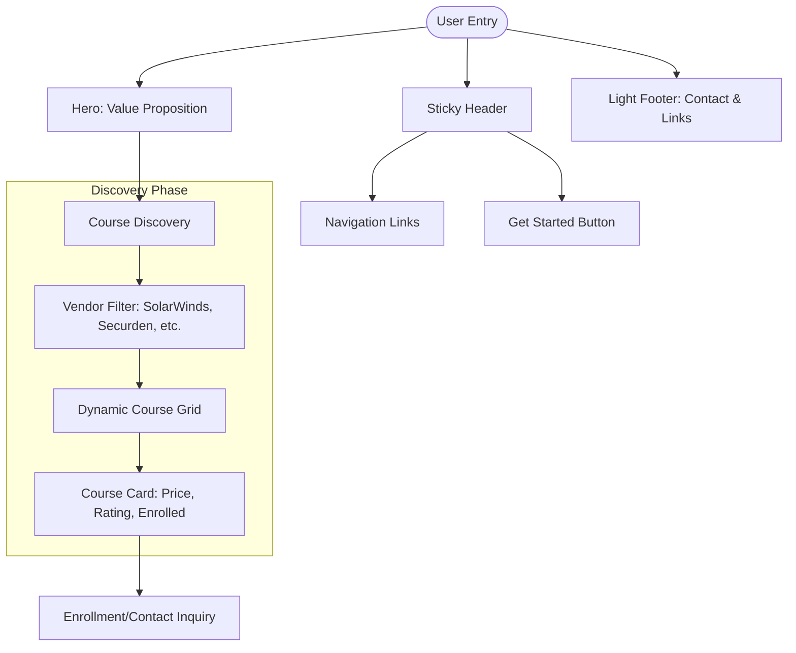
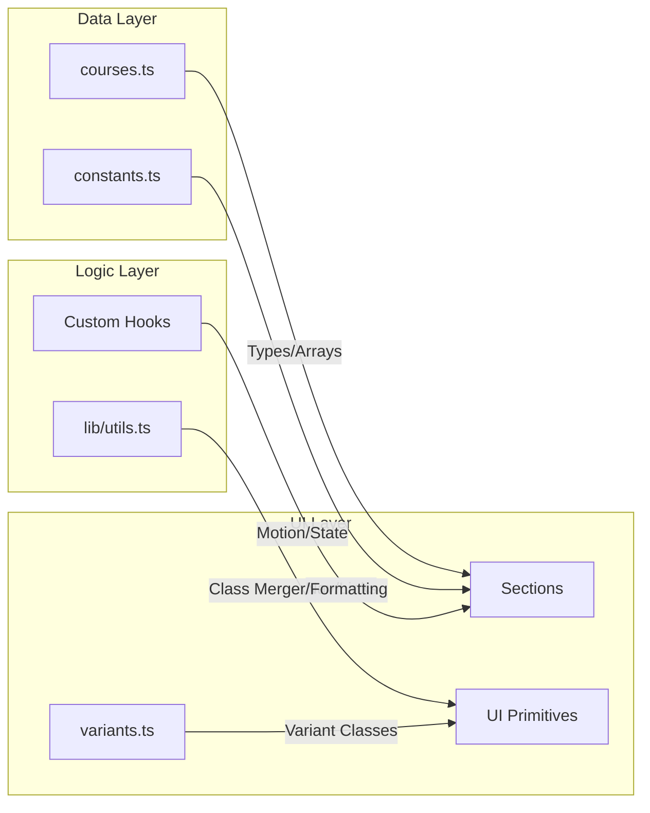

# Project Architecture Document (PAD) - iTrust Academy

> **The Definitive Technical Handbook & Source of Truth**
> **Project**: iTrust Academy - Enterprise IT Training Platform
> **Version**: 1.0.0
> **Last Updated**: March 28, 2026

---

## 1. Introduction & Purpose
This document serves as the primary technical blueprint for iTrust Academy. It provides a comprehensive map of the application's architecture, data structures, and operational flows. It is designed to initialize new developers or AI coding agents, enabling them to understand the system's DNA and handle PRs with minimal guidance.

---

## 2. Tech Stack Deep Dive

| Layer | Technology | Key Role |
| :--- | :--- | :--- |
| **Framework** | **React 19** | Core UI library utilizing modern hooks and concurrent rendering. |
| **Language** | **TypeScript 5.9** | Strict typing for build-time safety and self-documenting code. |
| **Build Tool** | **Vite 8** | Next-generation frontend tooling for HMR and optimized builds. |
| **Styling** | **Tailwind CSS v4** | CSS-first configuration, zero-JS runtime, high-performance styling. |
| **Animation** | **Framer Motion 12** | Scroll-linked animations and entrance transitions. |
| **Components** | **Radix UI** | Headless primitives ensuring WCAG AAA accessibility. |
| **State** | **Zustand 5** | Lightweight, fast external store for global state management. |
| **Validation** | **Zod 4** | Schema-first validation for data integrity and forms. |

---

## 3. File Hierarchy & Manifest

### 3.1 Directory Structure Diagram
```text
src/
├── app/                  # Application Core & Configuration
│   ├── app.tsx           # Main App component (Section orchestrator)
│   └── globals.css       # Tailwind v4 theme, variables, and global resets
├── assets/               # Static image and SVG assets
├── components/           # Component Library
│   ├── cards/            # Composite card components (e.g., CourseCard)
│   ├── forms/            # Form-specific logic and UI (React Hook Form)
│   ├── icons/            # Custom SVG brand icons (Lucide-compatible)
│   ├── layout/           # Global Layout: Header, Light Footer, Section Wrappers
│   ├── sections/         # Feature-specific landing page sections
│   └── ui/               # Atomic UI primitives (Button, Badge, Input, etc.)
├── data/                 # Static Data & Types (COURSES, VENDORS)
├── hooks/                # Custom React Hooks (useReducedMotion, useSyncExternalStore)
├── lib/                  # Utilities (cn, formatters) and App Constants
├── services/             # API layer and external integrations
├── styles/               # Framer Motion animation variants
└── types/                # Global Type Definitions & Vite Environment
```

### 3.2 Key File Descriptions
| File | Role | Responsibility |
| :--- | :--- | :--- |
| `src/main.tsx` | Entry Point | Mounts React to DOM; imports global styles. |
| `src/app/app.tsx` | Root Component | Orchestrates the vertical stacking of all landing page sections. |
| `src/app/globals.css` | Theme Engine | Defines OKLCH colors, brand shadows, and Tailwind v4 @theme. |
| `src/data/courses.ts` | Data Provider | Single source of truth for course/vendor objects and types. |
| `src/components/ui/variants.ts` | Design Logic | Centralizes CVA (Class Variance Authority) definitions. |
| `src/hooks/useReducedMotion.ts` | Accessibility | Uses `useSyncExternalStore` for performance-safe motion detection. |

---

## 4. Application Flowcharts

### 4.1 User Interaction Flow
The user navigates via a sticky header to interact with various value-driven sections.



### 4.2 Data & Logic Flow
Data flows from static definitions through typed interfaces to presentational components.



---

## 5. Data Architecture (Database Schema)

While current data is static, it follows a strict relational structure defined by TypeScript interfaces.

### 5.1 Course Entity (src/data/courses.ts)
| Property | Type | Description |
| :--- | :--- | :--- |
| `id` | `string` | Unique identifier (PK). |
| `slug` | `string` | URL-friendly identifier. |
| `title` | `string` | Main course headline. |
| `vendor` | `enum` | SolarWinds, Securden, Quest, Ivanti (FK-like). |
| `price` | `number` | Training cost in USD. |
| `featured` | `boolean` | Flag for promotion in the catalog. |
| `tags` | `string[]` | Technology categories. |

### 5.2 Vendor Entity (src/data/courses.ts)
| Property | Type | Description |
| :--- | :--- | :--- |
| `id` | `string` | Unique identifier (PK). |
| `name` | `string` | Brand name. |
| `color` | `string` | HEX/OKLCH brand color for accents. |

---

## 6. Design System & Constraints

### 6.1 Color & Visual Hierarchy
*   **Primary Brand**: Burnt Orange (`#f27a1a`) - Used for CTAs and highlights.
*   **Neutral Palette**: Deep Charcoal (`#1a1a2e`) for text; Slate Blue for secondary text.
*   **Shadow System**: Custom `shadow-brand` and `shadow-brand-lg` for depth on hover.
*   **Border Radius**: Global standard `0.5rem` (`md`) for a warm, modern feel.

### 6.2 Animation Principles (Framer Motion)
*   **Staggered Entrance**: Hero and grid items use staggered reveals.
*   **Viewport Sensitivity**: Animations only trigger when elements are in view.
*   **Accessibility First**: All motion respects the `prefers-reduced-motion` media query.

---

## 7. Development & Onboarding SOP

### 7.1 Immediate Initialization
1.  **Dependencies**: `npm install`
2.  **Linting Check**: `npm run lint` (0 errors required).
3.  **Build Check**: `npm run build` (Ensures Type/Vite integrity).
4.  **Dev Server**: `npm run dev` (Port 5173).

### 7.2 Critical Coding Rules
*   **Fast Refresh Safety**: Never export constants (like CVA variants) from a file that exports a component. Use `src/components/ui/variants.ts`.
*   **Tailwind v4**: Do not create a `tailwind.config.js`. Configure tokens inside `src/app/globals.css`.
*   **Lucide Compatibility**: For social icons, use the custom SVG components in `src/components/icons/social-icons.tsx`.

---

**This PAD represents the current state of iTrust Academy. Adhere strictly to these architectural patterns for all future PRs.**
