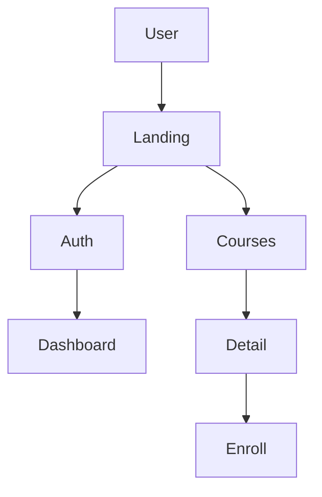
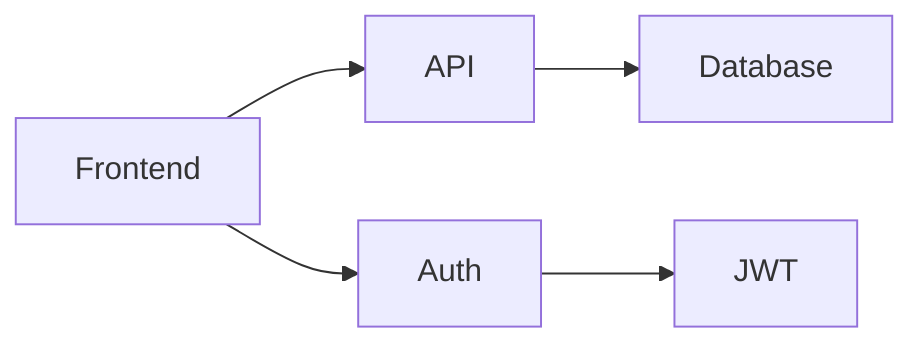
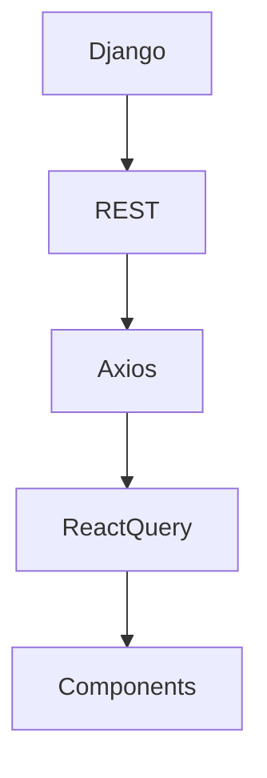

# Plan: Awesome README.md for iTrust Academy

## Executive Summary

Create a comprehensive, visually appealing, and informative README.md that serves as the single source of truth for the iTrust Academy project on GitHub.

---

## Design Principles

### 1. Visual Hierarchy
- Clear section headers with emojis
- Badges for tech stack
- Tables for structured information
- Code blocks for technical content
- Mermaid diagrams for architecture

### 2. Information Architecture
- Start with what users care about (features, demo)
- Progress to technical details
- End with contribution/deployment

### 3. GitHub-Optimized
- Render well on GitHub
- Use GitHub-flavored markdown
- Mermaid diagrams render natively
- Collapsible sections for long content

---

## README Structure Plan

### Section 1: Header & Badges
- Project name with emoji
- One-line tagline
- Tech stack badges (React, TypeScript, Tailwind, Vite, Django)
- License badge

### Section 2: Visual Demo
- Screenshot or GIF of the application
- Key features highlighted

### Section 3: Table of Contents
- Clickable links to all sections

### Section 4: About The Project
- What is iTrust Academy?
- Target audience
- Problem it solves

### Section 5: Features
- Organized by category (UI/UX, Course Catalog, Auth, Dashboard)
- Icons for each feature

### Section 6: Application Architecture
- **Mermaid Diagram: User Interaction Flow**
  - Shows user journey from landing to enrollment
- **Mermaid Diagram: Application Logic Flow**
  - Shows data flow from API to UI
- **Mermaid Diagram: Authentication Flow**
  - Shows JWT auth lifecycle

### Section 7: Project Structure
- File hierarchy with descriptions
- Key files highlighted
- Component organization explained

### Section 8: Routes & Pages
- Table of all routes
- Page descriptions

### Section 9: Tech Stack
- Frontend technologies
- Backend technologies
- DevOps tools
- With links to documentation

### Section 10: Getting Started
- Prerequisites
- Installation steps
- Environment setup
- Running locally

### Section 11: Development
- Available scripts
- Code conventions
- Testing approach

### Section 12: API Integration
- Authentication flow
- Key endpoints
- Data transformers

### Section 13: Deployment
- Netlify deployment
- Vercel deployment
- Docker deployment
- Environment variables

### Section 14: Contributing
- How to contribute
- Code standards
- PR process

### Section 15: License & Acknowledgments

---

## Mermaid Diagrams to Include

### Diagram 1: User Interaction Flow

### Diagram 2: Application Architecture

### Diagram 3: Data Flow

---

## Implementation Plan

### Step 1: Create README.md Structure
- Write all section headers
- Add table of contents

### Step 2: Add Visual Elements
- Create Mermaid diagrams
- Add badge links

### Step 3: Write Content
- Fill in each section
- Add code examples
- Include file hierarchy

### Step 4: Review & Validate
- Check markdown syntax
- Verify links work
- Test Mermaid rendering

---

## Validation Checklist

- [ ] All Mermaid diagrams render correctly
- [ ] All links are valid
- [ ] Table of contents links work
- [ ] Code examples are accurate
- [ ] File hierarchy matches actual structure
- [ ] Deployment steps are tested
- [ ] Screenshots are current

---

## Estimated Time: 2-3 hours
